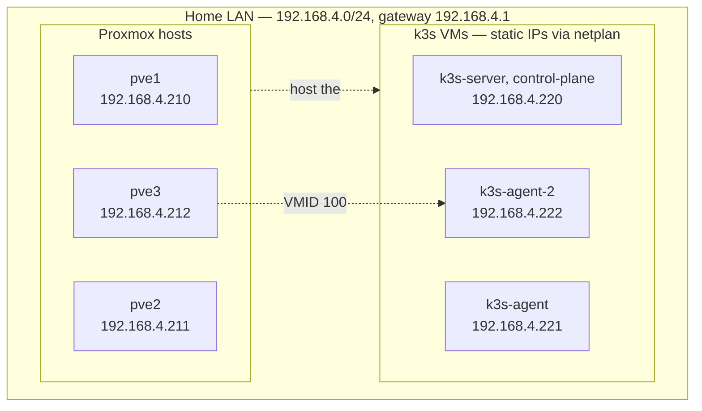
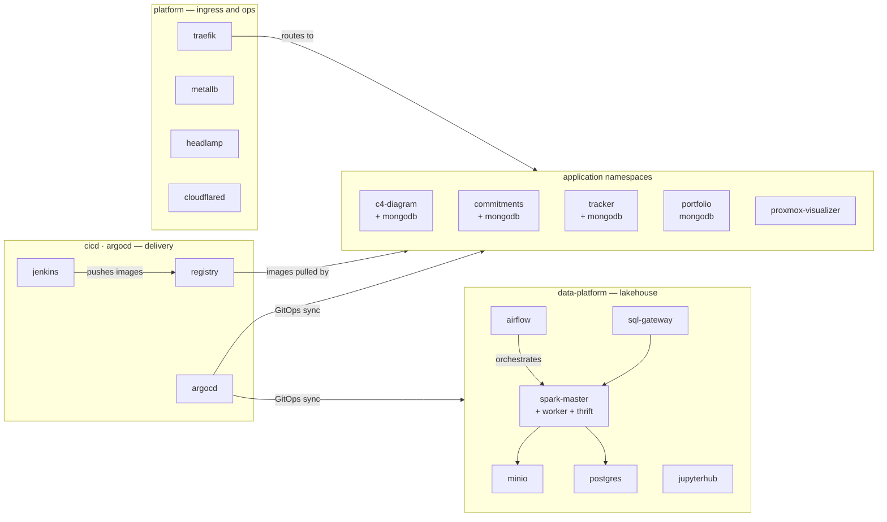
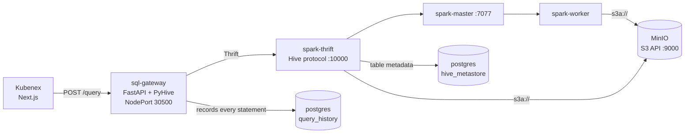
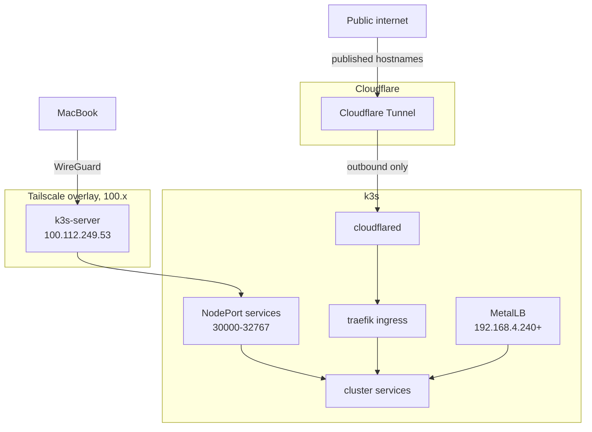

# Homelab Architecture

Reference for the k3s cluster behind Kubenex. Verified against the live cluster
on 19 Aug 2026.

## Quick reference

All services answer on the Tailscale address of the control-plane node,
`100.112.249.53`.

| Service | Port | Namespace |
|---|---|---|
| Airflow | 30880 | data-platform |
| JupyterHub | 30888 | data-platform |
| Spark Master UI | 30808 | data-platform |
| Spark Thrift (JDBC) | 30100 | data-platform |
| Spark Thrift UI | 32570 | data-platform |
| SQL Gateway | 30500 | data-platform |
| MinIO S3 API | 32000 | data-platform |
| MinIO Console | 32001 | data-platform |
| Jenkins | 30300 | cicd |
| Docker Registry | 32261 | cicd |
| ArgoCD | 30789 | argocd |
| Headlamp | 32526 | kube-system |

## Physical and virtual layout

Only `k3s-agent-2` has a confirmed host (pve3, VMID 100); the placement of the
other two VMs has not been verified.

Each VM pins its own address in `/etc/netplan/50-cloud-init.yaml` and its
`--node-ip` flag. Those two must agree, and `node-ip` must be set in exactly one
place — see the failure modes at the bottom.

## Cluster workloads

## Lakehouse data path

This is the chain a query travels from the Kubenex UI to storage.

Spark reads MinIO over `s3a://` directly — the `hadoop-aws` connector and AWS
SDK bundle are installed on the Thrift server. `bronze.sales` is a Parquet table at
`s3a://raw-data/test/sales.parquet`. There are no Delta jars installed, so table
formats are limited to Parquet, CSV, JSON, and ORC.

## How traffic reaches a service

Nothing inbound is exposed to the internet directly: the tunnel is established
outbound by `cloudflared`, and everything else is reachable only over Tailscale
or the LAN.

## Persistent storage

All volumes use the `local-path` provisioner, which is **node-bound** — a volume
lives on the node where it was first scheduled, and a pod that moves loses it.
This is why Kubenex query history goes to Postgres rather than a local SQLite
file.

| Claim | Size | Namespace |
|---|---|---|
| minio | 20 Gi | data-platform |
| postgres-data | 10 Gi | data-platform |
| airflow-logs | 5 Gi | data-platform |
| jupyter-notebooks | 5 Gi | data-platform |
| registry-data | 20 Gi | cicd |
| jenkins | 8 Gi | cicd |
| mongodb-data / backups | 2–5 Gi each | c4-diagram, commitments, portfolio, tracker |

Postgres holds four databases: `airflow`, `dataplatform` (Kubenex query
history), `hive_metastore`, and `mlflow`.

## Security posture

The SQL gateway has **no authentication**. Anything that can reach its NodePort
can execute arbitrary Spark SQL, including DDL. That is acceptable only because
the port is reachable solely from the LAN and the private Tailscale network —
it must not be exposed through the Cloudflare tunnel or any public ingress.

Credentials are never stored in this repository. Postgres and MinIO secrets are
supplied to workloads through Kubernetes secrets via `secretKeyRef`, and local
development values live in `.env.local`, which is gitignored.

## Failure modes worth remembering

**`node-ip` defined twice.** If `node-ip` appears in both
`/etc/rancher/k3s/config.yaml` and the systemd unit's `--node-ip` flag, k3s
concatenates them into `"IP,IP"`. The kubelet rejects that — a comma pair must be
one IPv4 and one IPv6 — and k3s shuts itself down **cleanly, with exit code 0**,
every 14 seconds. `systemctl status` reports `Result=success`, so it does not
look like a crash. Set `node-ip` in exactly one place.

**Cloud-init rewrites netplan on reboot.** Unless
`/etc/cloud/cloud.cfg.d/99-disable-network-config.cfg` exists containing
`network: {config: disabled}`, a reboot reverts the VM to its original address
and the cluster loses itself. Apply this on all three nodes before rebooting
anything.

**Airflow sizing.** Airflow idles around 1.4 GiB. A 2 GiB limit leaves too little
headroom and the container is OOM-killed the moment a heavier page loads. It now
runs with a 4 GiB limit and a 2 GiB request.
